# SUMMARY HASIL TRAINING DENGAN 4 MODEL

## Dataset pengguna 15 menit + data cuaca + fitur ektraksi 

### LSTM

### BIDIRECTIONAL LSTM

### LSTM - ATTENTION MECHANISM 

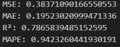

### BIDIRECTIONAL LSTM - ATTENTION MECHANISM

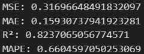

## Dataset pengguna 15 menit + data cuaca

### LSTM

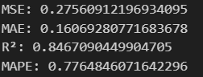

### BIDIRECTIONAL LSTM

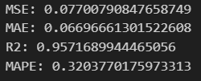

### LSTM - ATTENTION MECHANISM 

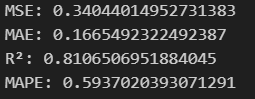

### BIDIRECTIONAL LSTM - ATTENTION MECHANISM

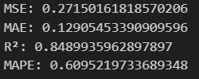

## Dataset pengguna 15 menit stasioner

### LSTM

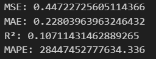

### BIDIRECTIONAL LSTM

### LSTM - ATTENTION MECHANISM 

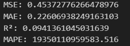

### BIDIRECTIONAL LSTM - ATTENTION MECHANISM

## Dataset pengguna 15 menit

### LSTM

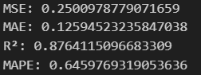

### BIDIRECTIONAL LSTM

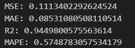

### LSTM - ATTENTION MECHANISM 

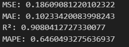

### BIDIRECTIONAL LSTM - ATTENTION MECHANISM

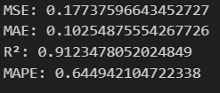

