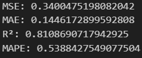
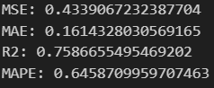
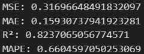

# SUMMARY HASIL TRAINING DENGAN 4 MODEL

## Dataset pengguna 15 menit + data cuaca + fitur ektraksi 

### LSTM

### BIDIRECTIONAL LSTM

### LSTM - ATTENTION MECHANISM 

### BIDIRECTIONAL LSTM - ATTENTION MECHANISM

## Dataset pengguna 15 menit + data cuaca
ongoing
## Dataset pengguna 15 menit stasioner
ongoing
## Dataset pengguna 15 menit
ongoing