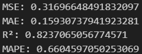

# SUMMARY HASIL TRAINING DENGAN 4 MODEL

Berdasarkan pemodelan yang menggunakan empat model berbeda dan empat jenis data dengan fitur yang bervariasi, disimpulkan bahwa model `Bidirectional LSTM` menghasilkan performa terbaik dibandingkan model lainnya, terutama pada data gabungan Penggunaan Listrik dan Data Cuaca. Hasil ini ditunjukkan oleh nilai `Mean Absolute Error (MAE)` sebesar `0,06697`, `Mean Squared Error (MSE)` sebesar `0,07701` (semakin mendekati nol menunjukkan akurasi yang lebih baik), serta `R2 Score` sebesar `0,95717` (semakin mendekati satu menunjukkan kecocokan model yang lebih baik).

Jika dibandingkan dengan jenis data yang berbeda, performa `Bidirectional LSTM` tetapi masih tebukti unggul di 3 dari 4 jenis data yaitu: Data penggunaan listrik stasioner, Data penggunaan listrik mentah/standard, dan data gabungan penggunaan listrik dan data cuaca. Dapat diurutkan sebagai berikut

1. Data gabungan penggunaan listrik dan data cuaca (R2 score: 0.95716)
2. Data penggunaan listrik mentah/standard (R2 score: 0.94498)
3. Data penggunaan listrik stasioner (R2 score: 0.14192)

Sedangkan untuk data gabungan penggunaan listrik yang sudah di ektraksi fitur dan data cuaca, `Bidirectional LSTM` hanya mendapatkan `R2 score` sebesar `0.75866`. Data ini terbukti lebih bagus dimodelkan menggunakan `Bidirectional LSTM + Attention Mechanism` dengan perolehan `R2 score` sebesar `0.82370`.

## Dataset pengguna 15 menit + data cuaca + fitur ektraksi 

### LSTM

### BIDIRECTIONAL LSTM

### LSTM - ATTENTION MECHANISM 

### BIDIRECTIONAL LSTM - ATTENTION MECHANISM

## Dataset pengguna 15 menit + data cuaca

### LSTM

### BIDIRECTIONAL LSTM

### LSTM - ATTENTION MECHANISM 

### BIDIRECTIONAL LSTM - ATTENTION MECHANISM

## Dataset pengguna 15 menit stasioner

### LSTM

### BIDIRECTIONAL LSTM

### LSTM - ATTENTION MECHANISM 

### BIDIRECTIONAL LSTM - ATTENTION MECHANISM

## Dataset pengguna 15 menit

### LSTM

### BIDIRECTIONAL LSTM

### LSTM - ATTENTION MECHANISM 

### BIDIRECTIONAL LSTM - ATTENTION MECHANISM

