# SUMMARY HASIL TRAINING DENGAN 4 MODEL

## Dataset pengguna hourly + data cuaca + fitur ektraksi 

### LSTM

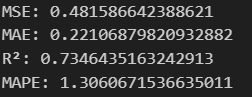

### BIDIRECTIONAL LSTM

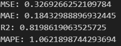

### LSTM - ATTENTION MECHANISM 

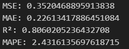

### BIDIRECTIONAL LSTM - ATTENTION MECHANISM

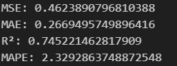

## Dataset pengguna hourly + data cuaca

### LSTM

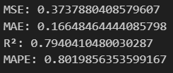

### BIDIRECTIONAL LSTM

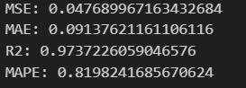

### LSTM - ATTENTION MECHANISM 

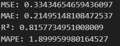

### BIDIRECTIONAL LSTM - ATTENTION MECHANISM

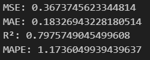

## Dataset pengguna hourly stasioner

### LSTM

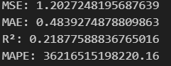

### BIDIRECTIONAL LSTM

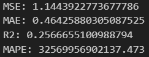

### LSTM - ATTENTION MECHANISM 

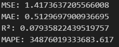

### BIDIRECTIONAL LSTM - ATTENTION MECHANISM

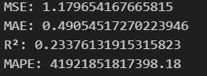

## Dataset pengguna hourly

### LSTM

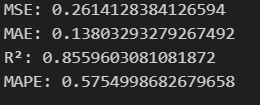

### BIDIRECTIONAL LSTM

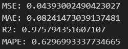

### LSTM - ATTENTION MECHANISM 

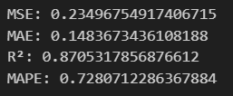

### BIDIRECTIONAL LSTM - ATTENTION MECHANISM

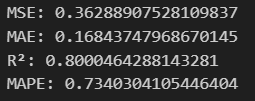

## Dataset pengguna hourly + meteostat

### LSTM

### BIDIRECTIONAL LSTM

### LSTM - ATTENTION MECHANISM 

### BIDIRECTIONAL LSTM - ATTENTION MECHANISM

## Dataset pengguna hourly + meteostat + fitur ekstraksi

### LSTM

### BIDIRECTIONAL LSTM

### LSTM - ATTENTION MECHANISM 

### BIDIRECTIONAL LSTM - ATTENTION MECHANISM

